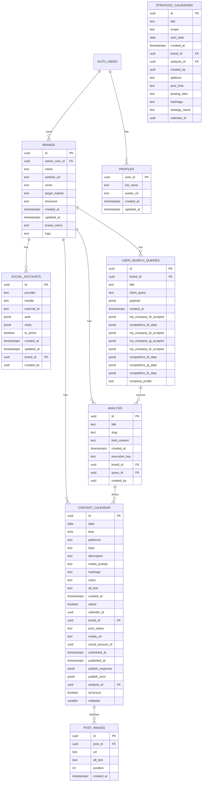

# DNAI Core Database Schema (Postgres) — GitHub‑Compatible ERD

> Updated: 2025-10-22  
> This version fixes the Mermaid `erDiagram` so it renders on GitHub.  
> **Why it broke:** Mermaid entity blocks cannot include arrows like `FK -> auth.users(id)`. Relationships must be declared on their own lines. Field lists should avoid inline FK arrows.

---

## Entity-Relationship Overview (Mermaid, GitHub-safe)

> **Note:** `AUTH_USERS` stands for `auth.users` (external to `public`).

---

## DDL & Notes

The full DDL remains the same as in the previous file. Keep using the existing SQL; only the diagram syntax changed for GitHub rendering.
